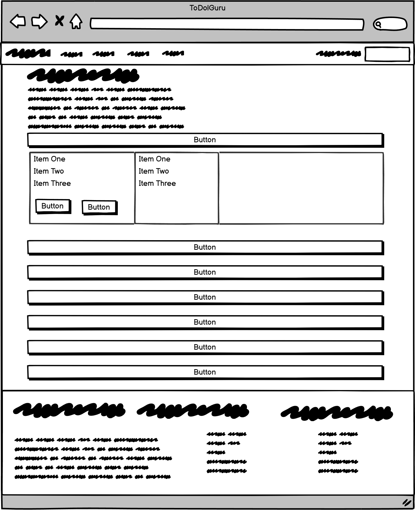

# todo-guru

Website project by Oscar Sabet

## Table of Contents

- [todo-guru](#todo-guru)
  - [Table of Contents](#table-of-contents)
  - [Planning](#planning)
    - [Design \& Planning](#design--planning)
      - [Wireframe](#wireframe)
    - [User Stories](#user-stories)
    - [Project board](#project-board)
  - [Development](#development)
  - [Deployment](#deployment)
  - [Testing](#testing)
  - [Features](#features)
  - [Site Contents](#site-contents)
  - [Repository](#repository)
  - [Sources](#sources)
  - [Full Screenshots](#full-screenshots)
    - [Create New Task](#create-new-task)

## Planning

### Design & Planning

#### Wireframe

- Agile methodology was used for planning and development.
- User stories were created to define the features and functionality of the app.
- Wireframes created to plan out layout of site

### User Stories

### Project board

## Development

## Deployment

## Testing

## Features

- Task creation, editing, and deletion
- Task status, priority, and category management
- Due date setting and notifications
- Project board (kanban) view
- User accounts with profile pictures

## Site Contents

## Repository

The Github repo can be found here.

[Github Repo](https://github.com/oscar-sabet/todo-guru)

The project Board can be found here.

[Github Project Board](https://github.com/users/oscar-sabet/projects/4)

The deployed Heroku project link can be found here.

[Deployed Link]()

## Sources

## Full Screenshots

### Create New Task
