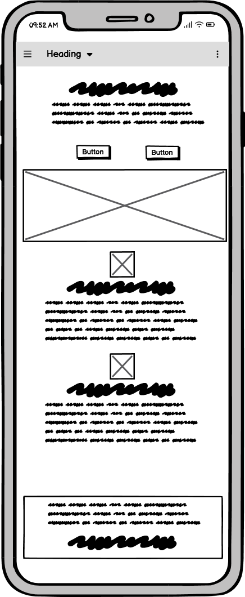
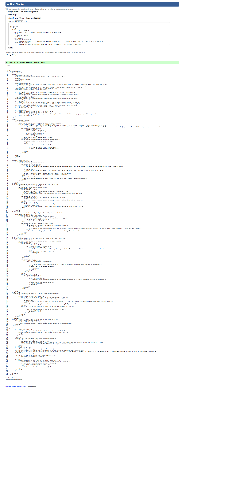
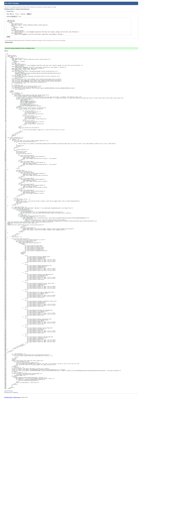

# todo-guru

Website project by Oscar Sabet

## Table of Contents

- [todo-guru](#todo-guru)
  - [Table of Contents](#table-of-contents)
  - [Introduction](#introduction)
  - [Repository](#repository)
  - [Agile Planning](#agile-planning)
    - [UI Design](#ui-design)
      - [Wireframe](#wireframe)
    - [User Stories](#user-stories)
    - [Project board](#project-board)
  - [Database](#database)
    - [Entity Relationship Diagram (ERD)](#entity-relationship-diagram-erd)
  - [AI Usage](#ai-usage)
  - [Deployment](#deployment)
  - [Testing](#testing)
  - [Key Features](#key-features)
  - [Site Contents](#site-contents)
  - [Sources](#sources)
  - [Future Developments](#future-developments)
    - [Email Notifications](#email-notifications)
    - [Account Reset Using Email](#account-reset-using-email)
  - [Validation](#validation)
    - [HTML](#html)
    - [CSS](#css)
    - [Jquery](#jquery)
    - [Python](#python)
  - [Testing Screenshots](#testing-screenshots)
  - [Full Screenshots](#full-screenshots)

## Introduction

ToDo|Guru is task management application coded in html/css, utilising the bootstrap framework, and python using the django framework.

The application provides a scalable & modern interface which allows users to manage their tasks easily and contains advanced features which allow users to organise & filter tasks.


## Repository

You can use username: `test` password: `password021` since it has some tasks already added.

The Github repo can be found here.

[Github Repo](https://github.com/oscar-sabet/todo-guru)

The project Board can be found here.

[Github Project Board](https://github.com/users/oscar-sabet/projects/4)

The deployed Heroku project link can be found here.

[Deployed Link](https://todo-guru-2-3e966323d05c.herokuapp.com/)

## Agile Planning

This project utilised an agile methodology for the project. making use of user stories, wireframes and a kanban board.

### UI Design

The application provides a scalable & modern interface which uses pastel colours and rounded corners with a minimalist philosophy.

#### Wireframe

Wireframes are a important part of the UI design process. They are simple sketches that outline the basic structure and layout of a web page or application. Wireframes help to visualize the placement of elements on the page and guide the development process.

The design did not change significantly during development but addition features, content and details were added to enhance the application beyond the initial scope.

home


home mobile



Task List


Task List mobile


Task Board


Task Board mobile


Profile


Profile mobile


### User Stories

User stories are a key component of agile development methodologies. They are short, simple descriptions of a feature or functionality told from the perspective of the end user. User stories help to capture the requirements of the application in a way that is easy to understand and communicate. They focus on the value that the feature will bring to the user and provide a basis for planning, development, and testing.

Example

```text
As a user, I want to create a new task so that I can keep track of my to-dos.

Acceptance Criteria:

   The user can access a form to create a new task.

   The form includes fields for title, description, status, priority, category, and due date.

   The task is saved to the database and appears in the task list.

Tasks:

   Create a form for adding new tasks.

   Implement form validation.

   Save the new task to the database.
```

This user story outlines the need for a task creation feature. It specifies the user's goal (to create a new task) and the reason behind it (to keep track of to-do items). The story details the necessary criteria for fulfilling this requirement and lists the specific tasks that must be completed to implement the feature.

You can find more user stories on the project board.

By using user stories, the ToDo|Guru application ensures that the development process is user-centered and focused on delivering value to the end user.

### Project board

A Kanban board is a visual tool used in Agile project management to visualize the flow of work and manage tasks efficiently. It consists of columns representing different stages of the workflow, and cards representing individual tasks. The Kanban board helps teams to track the progress of tasks, identify bottlenecks, and ensure a smooth flow of work.


[Github Project Board](https://github.com/users/oscar-sabet/projects/4)

This Kanban board provides a visual representation of the workflow for the ToDo|Guru application. 

It includes columns for different stages, `To Do` `In Progress` and `Done`. It also uses the labels `could-have`, `should-have` and `must-have` to prioritise tasks. The cards representing individual tasks.

By using a Kanban board, the ToDo|Guru application ensures that the development process is well-organized and focused on delivering value to the end user.

The Kanban board is closely related to Agile methodologies, which emphasize iterative development, continuous improvement, and collaboration. In Agile, the Kanban board is used to manage tasks and ensure a smooth flow of work. It helps teams to visualize the workflow, manage work in progress, and track progress, all of which are key principles of Agile.

## Database

ToDo|Guru uses PostgreSQL as its primary database. PostgreSQL is a powerful, open-source relational database management system that provides robust data storage and retrieval capabilities.

Interaction with Models

In Django, models are Python classes that define the structure of your database tables. Each model maps to a single table in the database. For example, the `Task` model defines the structure of the `tasks` table, including fields such as `title`, `description`, `status`, `priority`, and `due_date`. When you create, update, or delete a model instance, Django interacts with the PostgreSQL database to perform the corresponding SQL operations.

Interaction with Templates

Django templates are used to render HTML pages dynamically. When you query the database for model instances (e.g., retrieving a list of tasks), the data is passed to the template context. The template then uses this data to generate the HTML content. For example, the task list page retrieves tasks from the database and displays them in a structured format using the template.

Explanation


1. **User Model**:
   - This is the built-in Django `User` model which includes fields like `id`, `username`, `email`, and `password`. 

2. **Profile Model**:
   - `Profile` has a one-to-one relationship with the `User` model.
   - Fields:
     - `user`: A one-to-one field linking to the `User` model.
     - `profile_picture`: A Cloudinary field for storing profile pictures.

3. **Task Model**:
   - `Task` has a many-to-one relationship with the `User` model.
   - Fields:
     - `title`: A character field for the task title.
     - `description`: A text field for the task description.
     - `status`: A character field with choices for task status.
     - `created`: A datetime field for when the task was created.
     - `due_date`: A datetime field for the task's due date.
     - `completed_date`: A datetime field for when the task was completed.
     - `priority`: A character field with choices for task priority.
     - `category`: A character field with choices for task category.
     - `user`: A foreign key linking to the `User` model.

### Entity Relationship Diagram (ERD)


Relationships

- **User to Profile**: One-to-One relationship.
- **User to Task**: One-to-Many relationship.

## AI Usage

Key Decisions

AI was helpful in generating code for various parts of the ToDo|Guru application. For instance, AI-assisted in creating the initial structure of the views and templates, which significantly sped up development. The generated code provided a solid foundation that, in many cases, required minimal adjustments.

Bug Identification and Resolution

AI can play a role identifying and resolving bugs throughout the development process. It can suggest potential fixes and improvements when given an issue or error code.

Performance and UX Improvements

AI can contribute to performance and UX improvements by suggesting best practices and optimizations. For example, AI could recommended using Bootstrap for responsive design, which would improve the user interface across different devices.

Workflow Efficiency

AI influenced the workflow by automating repetitive tasks and providing intelligent code suggestions. This allowed for faster implementation of new features and a quicker resolution of issues.

Negatives

AI can have its negatives as well, which can significantly hinder development. It can generate bad code, which may be buggy and inefficient. The bad code could require several unnecessary imports or use a bad implementation which is discovered at a later point in development.

## Deployment

Deploying the application to heroku involved several steps.

1. **Preparing my project for heroku**
   - My project was uploaded to a github repository
   - Gunicorn was installed and configured
   - ensure all dependencies are listed in `requirements.txt` and the python version is listed in `.python-version`
   - configure static files and settings.py, paying special attention to disabling debugging and any other settings related to security.
   - set up and configure environmental files eg. `env.py`
   - create a `Procfile`. This file tells Heroku how to run your application.
   - ensure that any files that contain secret keys or other sensitive information eg. `env.py` is added to `.gitignore` and is not present in your github repo
  
2. **Deploying to Heroku**
   - Create heroku app
   - Link github repository & Code Institute PostGres database
   - Add environmental variables to heroku, such as, secret keys.
   - Deploy the application

## Testing

| **Feature**               | **Test Case**                                                                                       | **Expected Result**                                                                                       | **Result**                                                                                       |
|---------------------------|-----------------------------------------------------------------------------------------------------|-----------------------------------------------------------------------------------------------------------|---------------------------------------------------------------------------------------------------------|
| **User Registration**     | Navigate to the registration page. Fill in the form with valid details and submit.                  | User is registered and redirected to the login page.                                                      |PASS                                                                                                     |
|                           | Attempt to register with an existing username or email.                                             | Appropriate error message is displayed.                                                                   |PASS                                                                                                     |
| **User Login**            | Navigate to the login page. Fill in the form with valid credentials and submit.                     | User is logged in and redirected to the task list page.                                                   |PASS                                                                                                     |
|                           | Attempt to log in with invalid credentials.                                                         | Appropriate error message is displayed.                                                                   |PASS                                                                                                     |
| **User Logout**           | While logged in, click the logout button.                                                           | User is logged out and redirected to the login page.                                                      |PASS                                                                                                     |
| **Create Task**           | Click the "New Task" button. Fill in the form with valid details and submit.                        | Task is created and displayed in the task list.                                                           |PASS                                                                                                     |
| **Update Task**           | Click the "Update" button for an existing task. Modify the details and submit.                      | Task is updated and changes are reflected in the task list.                                               |PASS                                                                                                     |
| **Delete Task**           | Click the "Delete" button for an existing task. Confirm the deletion in the modal.                  | Task is removed from the task list.                                                                       |PASS                                                                                                     |
| **Mark Task as Completed**| Click the checkbox to mark a task as completed.                                                     | Task status is updated to "Completed" and visually distinguished from other tasks.                        |PASS                                                                                                     |
| **Filter Tasks by Status**| Use the status filter to display tasks with a specific status (Pending, In Progress, Completed).    | Only tasks with the selected status are displayed.                                                        |PASS                                                                                                     |
| **Filter Tasks by Category**| Use the category filter to display tasks with a specific category (Work, Personal, Home).         | Only tasks with the selected category are displayed.                                                      |PASS                                                                                                     |
| **Filter Tasks by Priority**| Use the priority filter to display tasks with a specific priority (Low, Medium, High).            | Only tasks with the selected priority are displayed.                                                      |PASS                                                                                                     |
| **Sort Tasks**            | Use the sort options to sort tasks by created date, due date, status, category, and priority.       | Tasks are sorted correctly based on the selected criteria.                                                |PASS                                                                                                     |
| **View Profile**          | Navigate to the profile page.                                                                       | User's profile information (username, email, profile picture) is displayed correctly.                     |PASS                                                                                                     |
| **Update Profile Picture**| On the profile page, upload a new profile picture.                                                  | Profile picture is updated and displayed correctly.                                                       |PASS                                                                                                     |

## Key Features

For screenshots use the link below.

[Full Screenshots](#full-screenshots)

1. **User Authentication**:
   - Secure user registration and login.
   - User-specific task management.

2. **Task Management**:
   - Create, update, and delete tasks.
   - Mark tasks as completed.
   - Filter tasks by status, category, and priority.
   - Sort tasks by created date, due date, status, category, and priority.

3. **Task Details**:
   - Add detailed descriptions to tasks.
   - Set due dates for tasks.
   - Track task creation and completion dates.
   - Calculate time taken to complete tasks and time until due.

4. **Task Categories and Priorities**:
   - Categorize tasks as Work, Personal, or Home.
   - Set task priorities as Low, Medium, or High.

5. **User Profile**:
   - Upload and display profile pictures using Cloudinary.
   - View user-specific task statistics.

6. **Responsive Design**:
   - Mobile-friendly and responsive user interface.
   - Use of Bootstrap for styling and layout.

7. **Real-time Updates**:
   - Use of modals for creating and deleting tasks without page reloads.
   - Real-time task status updates.

8. **Custom Filters and Sorting**:
   - Custom filters for task status, category, and priority.
   - Sorting options for better task management.
   - Template tags used to display datetime in more readable format.

9. **Statistics and Insights**:
   - View task statistics such as total tasks, completed tasks, pending tasks, and tasks in progress.
   - Breakdown of tasks by priority.

10. **Django Admin Integration**:
    - Manage tasks and users through the Django admin interface.

11. **Toast Notifications**:
    - Display toast notifications for various user actions such as task creation, update, deletion, and profile updates.
    - Provide real-time feedback to users, enhancing the user experience by confirming actions and displaying error messages when necessary.

12. **Project Board**:
    - Visualize the flow of work and manage tasks efficiently using a Kanban board.
    - Columns represent different stages of the workflow (To Do, In Progress, Done).
    - Cards represent individual tasks, with labels to prioritize tasks (could-have, should-have, must-have).
    - Helps track the progress of tasks, identify bottlenecks, and ensure a smooth flow of work.

13. **Profile Page**:
    - View and update profile picture.
    - Display various statistics about the user's tasks, such as total count of tasks, completed tasks, pending tasks, and tasks in progress.
    - Show the date the user account was created and the last login date.
    - Display the complete history of the user as recorded by the app.

## Site Contents

The ToDo|Guru application uses several templates to render different parts of the site. Each template serves a specific purpose and is designed to provide a seamless user experience.

home/home.html

The home.html template serves as the landing page for the ToDo|Guru application. It provides an overview of the application's features and benefits, encouraging users to sign up or log in to start managing their tasks. The template is designed with a clean and modern interface, using soft pastel colours and Bootstrap for a responsive design. It includes sections that highlight key features. This welcoming and informative homepage makes it easy for new users to understand the application and get started.

tasks/list.html

The tasks/list.html template displays a list of tasks for a logged-in user. It allows for sorting and filtering tasks based on various criteria. The template also includes a modal with a form for creating new tasks and displays statistics about the user's tasks. It contains count of completed tasks, count by status and count by category.

tasks/board.html

The tasks/board.html template presents a board view of tasks for the logged-in user, categorizing tasks by their status (not started, in progress, completed). This helps users to quickly assess the status of their tasks. The template allows tasks to be ordered by a specified field and displays the total count of tasks.

tasks/update_task.html

The tasks/update_task.html template provides a form for updating an existing task for the logged-in user. It displays the current details of the task and allows the user to modify and save changes.

tasks/profile.html

The tasks/profile.html template displays and allows updating the profile picture of the logged-in user. It includes a modal with a form for updating the profile picture and displays various statistics about the user's tasks. These statistics include the total count of tasks, completed tasks, pending tasks, and tasks in progress. The template also shows the date the user account was created and the last login date. It also shows the complete history of the user as recorded by the app.

## Sources

AI used for some code

Example code from the bootstrap documentation

images used on home page - <https://appigo.com/>

Guru logo - <https://www.flaticon.com/free-icon/guru_3174915?term=guru&page=1&position=1&origin=tag&related_id=3174915/>

profile placeholder image - <https://www.itsecurityguru.org/>

## Future Developments

ToDo|Guru aims to continuously improve and expand its features to enhance user experience and functionality. Here are some of the planned future developments:

### Email Notifications

One of the key features planned for future development is the integration of email notifications. Users will be able to receive email reminders for upcoming due dates, task deadlines, and important updates. Additionally, users could also have the option to customize the frequency and type of notifications they wish to receive.

### Account Reset Using Email

Another important feature is the ability to reset account passwords using email. The process will involve sending a password reset link to the user's registered email address, allowing them to set a new password. This feature will enhance the security and user-friendliness of the application, ensuring that users can easily regain access to their accounts.

## Validation

### HTML

There were no HTML errors but the lighthouse report did show some room for improvement.

Home Page



Task-List


Tasks Board


Account



Lighthouse


### CSS


### Jquery


### Python

To avoid too much screenshot bloat I have Included some of the most important files.

views


Admin


custom_filters


Forms


Models


Signals


urls


## Testing Screenshots

Testing Sign Out


testing empty form - Sign in


Testing incorrect username/password


Testing updating task


Testing empty field - create task form


Testing delete task


Testing change status in project board


Testing change profile picture


## Full Screenshots

Home Desktop


Home Mobile


Tasks List Desktop


Tasks List Mobile


Board Desktop


Board Mobile


Profile Desktop


Profile Mobile


